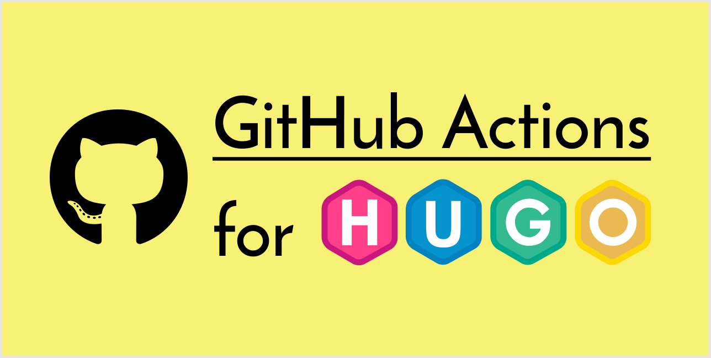

[](https://github.com/peaceiris/actions-hugo/blob/master/LICENSE)
[](https://github.com/peaceiris/actions-hugo/releases/latest)
[](https://github.com/peaceiris/actions-hugo/releases)




## GitHub Actions for Hugo extended

- [gohugoio/hugo: The world’s fastest framework for building websites.](https://github.com/gohugoio/hugo)


## Getting started

### Create `main.workflow`

An example with [GitHub Actions for deploying to GitHub Pages with Static Site Generators]

[GitHub Actions for deploying to GitHub Pages with Static Site Generators]: https://github.com/peaceiris/actions-gh-pages

```hcl
workflow "GitHub Pages" {
  on = "push"
  resolves = ["deploy"]
}

action "is-branch-master" {
  uses = "actions/bin/filter@master"
  args = "branch master"
}

action "build" {
  needs = "is-branch-master"
  uses = "peaceiris/actions-hugo@v0.55.6"
  args = ["--gc", "--minify", "--cleanDestinationDir"]
}

action "deploy" {
  needs = "build"
  uses = "peaceiris/actions-gh-pages@v1.0.0"
  env = {
    PUBLISH_DIR = "./public"
    PUBLISH_BRANCH = "gh-pages"
  }
  secrets = ["ACTIONS_DEPLOY_KEY"]
}
```


## License

[MIT License - peaceiris/actions-hugo]

[MIT License - peaceiris/actions-hugo]: https://github.com/peaceiris/actions-hugo/blob/master/LICENSE


## Supprt author

<a href="https://www.patreon.com/peaceiris"></a>
